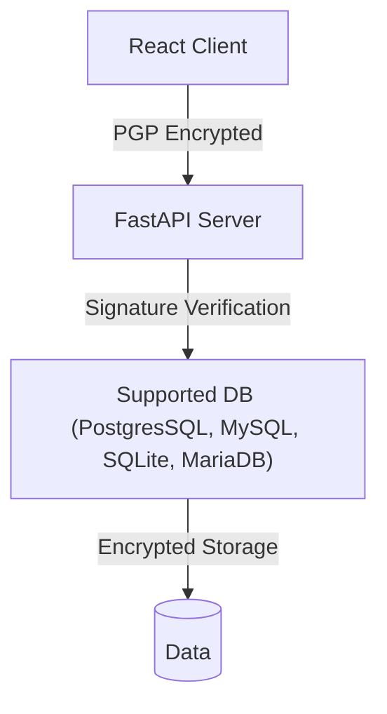

# Quanta Messenger - MVP v0.0.5

**Secure Communication Evolved**  
End-to-End Encrypted Messaging with Client-Side PGP Protection

## 🔒 Secure Messaging

Quanta Messenger redefines digital privacy with its groundbreaking **client-side PGP encryption**. Our MVP release (v0.0.5) ensures your conversations remain truly private through cryptographic guarantees rather than policy promises.

### ✨ Core Technology Stack



## 🌟 Key Security Features

- **🔑 Client-Side PGP Encryption**
  Messages are encrypted/decrypted exclusively in your browser - we never see your content

- **🛡️ Server-Side Signature Verification**
  Cryptographic verification prevents message tampering in transit

- **🪄 Ready for proxying**
  Servers using only http protocol

- **📸 Media Encryption (Upcoming)**
  Support for encrypted images and videos in development

- **🚫 Zero Knowledge Architecture**
  Servers process encrypted content without decryption capability

## ⚙️ Technical Architecture

| Component              | Technology                        | Purpose                          |
|------------------------|-----------------------------------|----------------------------------|
| **Frontend**           | React                             | Client-side encryption           |
| **Backend**            | FastAPI (Python)                  | Signature verification           |
| **Database**           | PostgreSQL, SQLite, MariaDB, MySQL| Encrypted message storage        |
| **Encryption**         | PGP                               | End-to-end protection            |

## 🚀 Getting Started - Backend Setup

### Prerequisites
- uv 0.7.20+

### Server installation
```bash
# Clone repository
git clone https://github.com/white-shark-code/Quanta-Messager.git

# Create virtual environment
cd server

# Installing the correct version of python
uv python install 3.13

# Create venv and install package
uv sync --extra sqlite
source .venv/bin/activate

# Configure environment
cp .env.example .env
# Set your DB credentials and configure secret keys
nano .env

# Run database migrations
alembic upgrade head

# Start FastAPI server
uvicorn src.main:app --reload
```

## 📜 Development Roadmap

### Current Version (0.0.5 MVP)
- Core messaging functionality
- Server-side signature verification

### Immediate Next Steps
0. Events for notification
1. React client implementation
2. Encrypted image support
3. Encrypted video support
4. Group chat support

## 📄 License

Released under the **[MIT License](LICENSE)**  

---

> **True privacy requires more than promises - it requires cryptography.**  
> Experience message security where only you hold the keys.

**Development Status:** Active MVP Development  
**Next Milestone:** React Client Implementation
